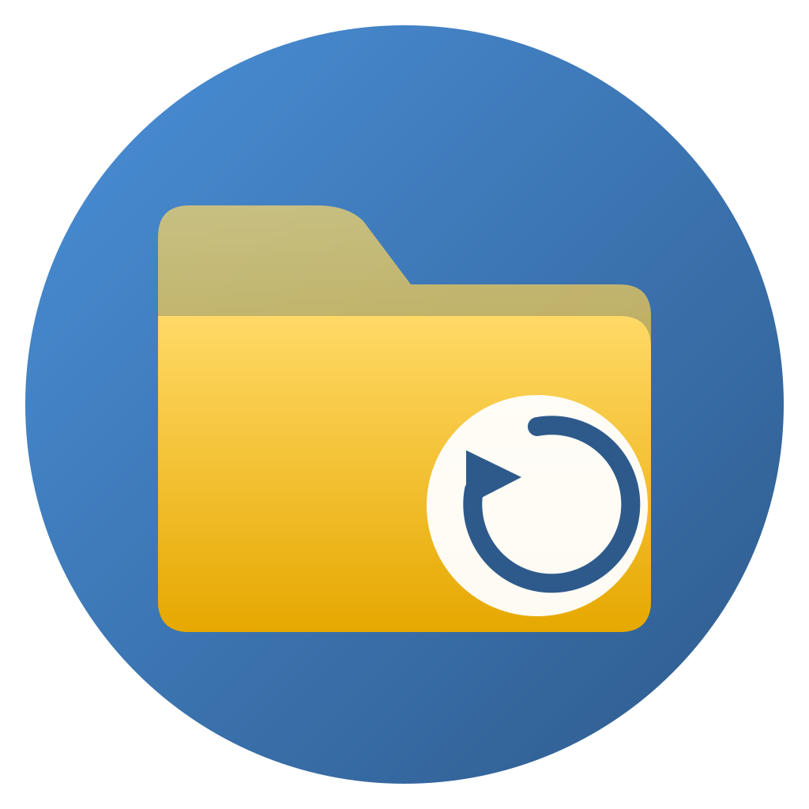

# 💾 macOS Backup Suite

<p align="center">
  
</p>

<p align="center">
  <strong>Umfassendes Backup- und Wiederherstellungswerkzeug für macOS</strong>
</p>

<p align="center">
  <a href="https://github.com/nojan01/macos-backup-tauri/releases/latest">
    
  </a>
  <a href="https://github.com/nojan01/macos-backup-tauri/blob/main/LICENSE">
    
  </a>
</p>

---

## ✨ Features

### 📦 Backup
- **Ordner-Backup** – Wichtige Verzeichnisse als komprimierte Archive (.tar.zst)
- **Homebrew** – Paketlisten (Brewfile) + optionaler Cache (max. 2 GB)
- **Mac App Store** – Alle installierten MAS-Apps
- **VS Code** – Erweiterungen und Einstellungen
- **Safari** – Lesezeichen, Leseliste, Erweiterungen, Preferences
- **Konfigurationsdateien** – SSH, Git, Shell-Configs

### ⚡ Parallele Verarbeitung (NEU in v1.1)
| Feature | Parallelität | Zeitersparnis |
|---------|-------------|---------------|
| MAS-Installation | 4 gleichzeitig | ~60-80% |
| VS Code Extensions | 6 gleichzeitig | ~50-70% |
| Backup-Verifizierung | 4 Threads | ~40% |

### 🔄 Quick-Restore Modus
Essentielle Tools in unter 10 Minuten:
- **Basis-Tools:** git, vim, python, node, wget, curl, jq, zsh
- **Essential Apps:** VS Code, iTerm2, Chrome, Firefox, Alfred, Raycast

### 🛡️ Sicherheit
- SHA-256 Hash-Verifizierung aller Archive
- Vollständige Backup-Metadaten in JSON
- Automatische Bereinigung unvollständiger Backups

---

## 📥 Installation

### Download
Laden Sie die neueste Version herunter:
➡️ **[macOS Backup Suite v1.1.0](https://github.com/nojan01/macos-backup-tauri/releases/latest)**

### Voraussetzungen
- macOS 12.0 oder neuer
- [Homebrew](https://brew.sh) (empfohlen)
- Festplattenvollzugriff (Full Disk Access) für vollständige Backups

### Erste Schritte
1. DMG öffnen und App nach `/Applications` ziehen
2. Systemeinstellungen → Datenschutz → Festplattenvollzugriff → App hinzufügen
3. App starten und Backup-Ziel auswählen

---

## 🖥️ Screenshots

<p align="center">
  <em>Hauptfenster mit Backup-Übersicht</em>
</p>

---

## 🛠️ Entwicklung

### Technologie-Stack
- **Frontend:** TypeScript, HTML, CSS (Vanilla)
- **Backend:** Rust (Tauri 2.x)
- **Kompression:** zstd (mit gzip-Fallback)

### Build
```bash
# Dependencies installieren
npm install

# Development-Server starten
npm run tauri dev

# Production-Build erstellen
npm run tauri build

# DMG in App einbetten
./embed-dmg.sh
```

### Projektstruktur
```
macos-backup-tauri/
├── src/                    # TypeScript Frontend
│   ├── main.ts
│   └── styles.css
├── src-tauri/              # Rust Backend
│   └── src/lib.rs
├── public/
│   └── help.html           # Hilfe-Dokumentation
└── index.html
```

---

## 📋 Changelog

### v1.1.0 (Dezember 2025)
- ⚡ Parallele MAS-Installation (4×)
- ⚡ Parallele VS Code Extension Installation (6×)
- ⚡ Parallele Backup-Verifizierung (4 Threads)
- 🔄 Quick-Restore Modus für essenzielle Pakete
- 🧭 Safari-Einstellungen Backup (Lesezeichen, Erweiterungen, etc.)
- 🍺 Homebrew-Cache Backup (max. 2 GB, Offline-Installation)
- 📖 Aktualisierte Hilfe-Dokumentation

### v1.0.0 (Dezember 2025)
- Initiales Release
- Ordner-Backup mit zstd-Kompression
- Homebrew, MAS, VS Code Backup
- Vollständige Wiederherstellung
- SHA-256 Verifizierung

---

## 📄 Lizenz

MIT License – siehe [LICENSE](LICENSE)

---

<p align="center">
  Made with ❤️ for macOS
</p>
