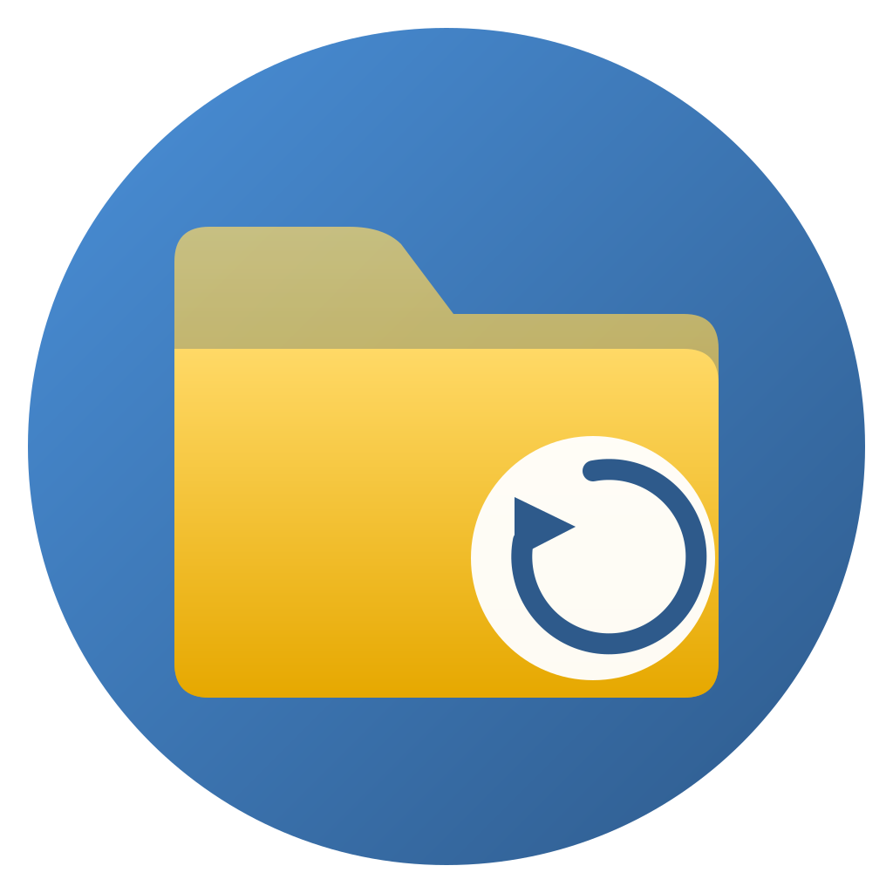
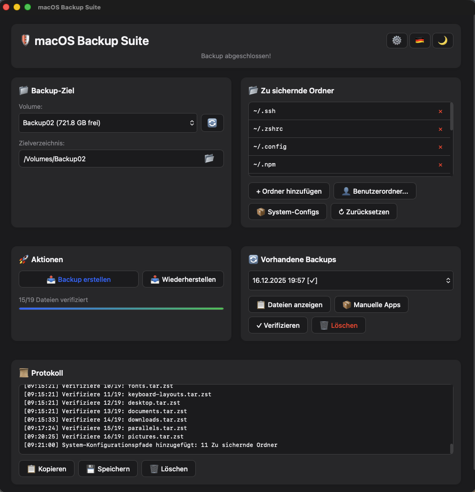

# 💾 macOS Backup Suite

<p align="center">
  
</p>

<p align="center">
  <strong>Umfassendes Backup- und Wiederherstellungswerkzeug für macOS</strong>
</p>

<p align="center">
  <a href="https://github.com/nojan01/macos-backup-tauri/releases/latest">
    
  </a>
  <a href="https://github.com/nojan01/macos-backup-tauri/blob/main/LICENSE">
    
  </a>
</p>

---

## ✨ Features

### 🛡️ Allgemein
- Dieses Programm ist kein Backup Programm im klassischen Sinn. Es installiert
  nicht das Betriebssystem MacOS nach einem Crash oder während einer geplanten
  Neuinstallation. Dieses Software ermöglicht es Ihre Software/ Apps, bestimmte
  Betriebssystemsettings und Ihre persönlichen Ordner auf eine effiziente
  Art wieder herzustellen. Dies ist besonders dann hilfreich wenn Ihr System
  fehlerhaft ist, die Performance nicht Ihren Vorstellungen entspricht oder Ihr 
  System mit allen möglichen nicht mehr benötigten Daten zugemüllt ist.
  Programme, welche manuell, also nicht über den Apple App Store oder über Homebrew,
  installiert wurden, müssen auch manuell wieder hergestellt werden. Eine Liste dieser
  Programme wird erstellt.

### 📦 Backup
- **Ordner-Backup** – Wichtige Verzeichnisse als komprimierte Archive (.tar.zst)
- **Homebrew** – Paketlisten (Brewfile) + optionaler vollständiger Download-Cache
- **Mac App Store** – Alle installierten MAS-Apps
- **VS Code** – Erweiterungen und Einstellungen
- **Safari** – Lesezeichen, Leseliste, Erweiterungen, Preferences
- **Konfigurationsdateien** – SSH, Git, Shell-Configs

### ⚡ Parallele Verarbeitung (NEU in v1.1)
| Feature | Parallelität | Zeitersparnis |
|---------|-------------|---------------|
| MAS-Installation | 4 gleichzeitig | ~60-80% |
| VS Code Extensions | 6 gleichzeitig | ~50-70% |
| Backup-Verifizierung | 4 Threads | ~40% |

### 🔄 Quick-Restore Modus
Essentielle Tools in unter 10 Minuten:
- **Basis-Tools:** git, vim, python, node, wget, curl, jq, zsh
- **Essential Apps:** VS Code, iTerm2, Chrome, Firefox, Alfred, Raycast

### 🛡️ Sicherheit
- SHA-256 Hash-Verifizierung aller Archive
- Vollständige Backup-Metadaten in JSON
- Fehlerhafte Archive werden nicht als erfolgreiche Sicherung übernommen; unterbrochene Backups können fortgesetzt werden

### Zuverlässigkeit der Datensicherung

- Ausgewählte Ordner werden vollständig archiviert, einschließlich leerer Verzeichnisse,
  versteckter Dateien, `Logs`, Caches und `node_modules`. Es gibt keine stillen Ausschlüsse.
  Die frühere Umgebungsvariable `BACKUP_EXTRA_EXCLUDES` führt bei gesetztem Wert zu einer
  Fehlermeldung, damit eine alte Konfiguration keine Daten unbemerkt auslässt.
- Inkrementelle Vergleiche lesen SHA-256-Prüfsummen der Dateiinhalte sowie Dateityp,
  nanosekundengenaue Zeitstempel, Rechte, Eigentümer, Dateiflags, ACLs, erweiterte
  Attribute und Symlink-Ziele. Auch leere Verzeichnisse werden erfasst.
  Alte Manifeste mit ausschließlich Größe und Sekundenzeitstempel werden nicht wiederverwendet.
- Einzeldateien und Ordner werden mit macOS-System-tar im PAX-Format archiviert.
  Jedes neue oder wiederverwendete Datenarchiv wird probeweise in ein privates lokales
  Verzeichnis entpackt. Inhalte, Rechte, ACLs, erweiterte Attribute, Zeitstempel und
  Verknüpfungen werden mit der Quelle verglichen. Die Rückleseprüfung benötigt lokalen
  temporären Speicher für jeweils einen entpackten Quellordner; der Platz wird geprüft.
- Fehlende oder unlesbare Quellen, Lese-/Schreibfehler und nicht unterstützte
  Spezialdateien wie Sockets/FIFOs brechen die Sicherung ab. Fehlende ausgewählte
  Homebrew-/App-Store-Inventare sind ebenfalls Fehler. Die Auswahl lässt sich in den
  Einstellungen ändern. Ein Backup-Ziel innerhalb einer Quelle wird abgelehnt.
- Quellen werden vor dem Archivieren und nochmals vor dem Abschluss geprüft.
  Archive, Manifeste, Zwischenstände und Abschlussmetadaten werden über temporäre
  Dateien, Synchronisierung und atomisches Umbenennen veröffentlicht.
  `metadata.json` entsteht erst nach erfolgreicher Abschlussprüfung.
- Ein Wiederanlauf erstellt die ausgewählten Quellen erneut aus ihrem aktuellen
  Zustand. Bereits abgeschlossene Teilarchive werden nicht blind übernommen.
  Verifizierte, unveränderte Archive eines früheren **vollständigen** Backups können
  weiterhin per Hardlink wiederverwendet werden, ohne sie beim nächsten Lauf zu überschreiben.

**Betriebsgrenze:** Dies ist eine Dateisicherung ohne APFS-Volume-Snapshot und ohne
anwendungsspezifisches Datenbank-Backup. Datenbanken, virtuelle Maschinen und andere
schreibende Programme vor der Sicherung schließen. Erkannte Änderungen während der
Sicherung führen zu einem Fehler; eine atomare Momentaufnahme aller laufenden Apps
kann das Verfahren nicht garantieren. Erforderlicher Festplattenvollzugriff muss erteilt
sein. Auch ein erfolgreicher Test ersetzt keine regelmäßig geprüfte zweite Sicherung
auf einem unabhängigen Datenträger.

Beim Restore werden Dateien dem wiederherstellenden Benutzer zugeordnet; frühere
Eigentümer-IDs werden nicht privilegiert übernommen. Bei „Überschreiben“ werden auch
Metadaten vorhandener Verzeichnisse wiederhergestellt. Ohne „Überschreiben“ bleiben
vorhandene Einträge und ihre Metadaten erhalten.

### 🔗 Symlink-Handling

Das Backup behandelt symbolische Links bewusst **als Symlinks** und folgt ihnen
nicht — weder beim Archivieren noch beim Berechnen von Snapshots oder Größen.
Das hat konkrete Konsequenzen, die Sie kennen sollten:

- **Archivierung (tar):** `tar` speichert Symlinks standardmäßig als Links,
  nicht als Kopie des Zielinhalts. Ein Symlink, der auf ein Verzeichnis
  außerhalb des Backup-Scopes zeigt, wird also nur als Verweis gesichert.
  Zeigt der Link nach der Wiederherstellung ins Leere, ist das **kein Fehler
  des Backups**, sondern ein Hinweis, dass das Ziel selbst nicht Teil der
  gesicherten Ordnerliste war.
- **Inkrementelle Snapshots:** Der Manifest-Vergleich (`follow_links(false)`)
  erkennt **Änderungen am Symlink selbst** (Ziel-Pfad, mtime), aber **nicht**
  Änderungen am referenzierten Inhalt. Wenn nur das Ziel eines Symlinks
  modifiziert wird und das Ziel **außerhalb** des gesicherten Baumes liegt,
  erscheint das Archiv als unverändert und wird per Hardlink wiederverwendet.
- **Größenberechnung / Platzbedarf:** Symlinks enthalten nur den Verweis. Ihr
  Zielinhalt wird nur gesichert, wenn er selbst innerhalb der ausgewählten Quellen
  liegt. Zusätzlich zum Archiv benötigt die Rückleseprüfung lokalen temporären Platz.
- **Restore / Extraktion:** Beim Zurückspielen werden Symlinks 1:1
  rekonstruiert. Existiert das ursprüngliche Zielsystem nicht mehr (z. B.
  externe Homebrew-Pfade nach Hardware-Wechsel), bleibt der Link als
  „dangling symlink" bestehen, bis die referenzierten Pfade wiederhergestellt
  werden.
- **Sicherheit:** Vor dem Restore werden die SHA-256-Prüfsummen aller ausgewählten Archive und deren tar-Header geprüft. Absolute Eintragspfade, `..`, Pfadkollisionen, Gerätedateien und Einträge unterhalb eines Archiv-Symlinks werden abgelehnt. Die Extraktion erfolgt zuerst in einem privaten Zwischenverzeichnis. Symlinks werden als Links wiederhergestellt; beim Zusammenführen werden vorhandene Ziel-Symlinks nicht als Verzeichnisse verfolgt.

**Empfehlung:** Vermeiden Sie Symlinks, die aus dem Backup-Scope in
ungesicherte Bereiche zeigen, wenn diese Inhalte mit der Wiederherstellung
zurückkehren sollen. Fügen Sie stattdessen das Zielverzeichnis direkt in die
Sicherungsliste ein.

---

## 📥 Installation

### Download
Laden Sie die neueste Version herunter:
➡️ **[macOS Backup Suite v1.2.10](https://github.com/nojan01/macos-backup-tauri/releases/latest)**

### Voraussetzungen
- macOS 12.0 oder neuer
- [Homebrew](https://brew.sh) (empfohlen)
- Festplattenvollzugriff (Full Disk Access) für vollständige Backups

### Erste Schritte
1. DMG öffnen und App nach `/Applications` ziehen
2. Systemeinstellungen → Datenschutz → Festplattenvollzugriff → App hinzufügen
3. App starten und Backup-Ziel auswählen

---

## 🖥️ Screenshots

<p align="center">
  
  <br>
  <em>Hauptfenster mit Backup-Übersicht, Ordnerauswahl und Protokoll</em>
</p>

---

## 🛠️ Entwicklung

### Technologie-Stack
- **Frontend:** TypeScript, HTML, CSS (Vanilla)
- **Backend:** Rust (Tauri 2.x)
- **Kompression:** zstd (mit gzip-Fallback)

### Build
```bash
# Dependencies installieren
npm install

# Development-Server starten
npm run tauri dev

# Production-Build erstellen
npm run tauri build

# DMG in App einbetten
./embed-dmg.sh
```

### Projektstruktur
```
macos-backup-tauri/
├── src/                    # TypeScript Frontend
│   ├── main.ts
│   └── styles.css
├── src-tauri/              # Rust Backend
│   └── src/lib.rs
├── public/
│   └── help.html           # Hilfe-Dokumentation
└── index.html
```

---

## 📋 Changelog

### v1.1.0 (Dezember 2025)
- ⚡ Parallele MAS-Installation (4×)
- ⚡ Parallele VS Code Extension Installation (6×)
- ⚡ Parallele Backup-Verifizierung (4 Threads)
- 🔄 Quick-Restore Modus für essenzielle Pakete
- 🧭 Safari-Einstellungen Backup (Lesezeichen, Erweiterungen, etc.)
- 🍺 Homebrew-Cache Backup (max. 2 GB, Offline-Installation)
- 📖 Aktualisierte Hilfe-Dokumentation

### v1.0.0 (Dezember 2025)
- Initiales Release
- Ordner-Backup mit zstd-Kompression
- Homebrew, MAS, VS Code Backup
- Vollständige Wiederherstellung
- SHA-256 Verifizierung

---

## 📄 Lizenz

MIT License – siehe [LICENSE](LICENSE)

---

<p align="center">
  Made with ❤️ for macOS
</p>


## Restore-Verhalten und Tests

- Ohne **Überschreiben** werden vorhandene Ordner zusammengeführt: fehlende Dateien kommen hinzu, vorhandene Dateien und Links bleiben erhalten. Mit Überschreiben werden einzelne Dateien/Links atomar ersetzt. Konflikte zwischen einer Datei und einem Verzeichnis werden als Fehler gemeldet; Verzeichnisbäume werden nicht automatisch gelöscht.
- Alle ausgewählten Archive müssen vor Beginn die Hash- und Inhaltsprüfung bestehen. Ein Test-Restore führt dieselbe Vorprüfung aus und schreibt anschließend in einen eigenen Unterordner.
- Neue Archive erhalten einen Namen mit einem Hash des vollständigen Quellpfads. Bestehende gzip-/zstd-Backups sind weiterhin lesbar. Alte Backups mit kollidierenden Archivnamen oder ungültigen Hashes werden abgelehnt; bereits überschriebene Archivdaten lassen sich dadurch nicht zurückholen. Dafür ist ein neues Backup erforderlich.
- Archive werden zunächst separat erstellt und danach umbenannt. Auch beim Fortsetzen einer Sicherung bleiben bereits vorhandene, eventuell mit älteren Backups hartverlinkte Archive bei Fehlern unberührt.
- Das Backup-Menü unterscheidet **Metadaten lesbar** von **verifiziert**. Ein Häkchen erscheint erst nach einer erfolgreichen Prüfung in der aktuellen Sitzung; beim Neuladen wird es zurückgesetzt. Restore prüft die Daten unabhängig davon erneut.
- Safari enthält auch die allgemeinen Preferences und den Favicon-Cache. Safari sollte vor einem echten Restore beendet sein, damit die laufende Anwendung die zurückgespielten Daten nicht wieder überschreibt.
- Homebrew-Paketnamen werden aus dem Brewfile gelesen und über direkte Prozessargumente installiert. Ruby-/Shell-Code aus der Datei wird nicht ausgeführt. Bundle-spezifische Optionen für Dienste und Verlinkungen werden nicht automatisch angewendet; dies wird im Protokoll angezeigt. MAS- und VS-Code-Installationsfehler führen auch bei Teilerfolg zu einer Fehlermeldung.
- Neue Standardordner verwenden `~/Documents` und `~/Desktop`. Bereits gespeicherte absolute Pfade bleiben absolute Ziele, auch bei einem anderen Benutzerkonto. Für einen solchen Umzug zuerst den Test-Restore verwenden und die Dateien in das gewünschte Konto übernehmen.
- Die Zwischenablage für große Verzeichnis-Restores liegt auf dem Ziellaufwerk. Dort wird freier Platz für das entpackte Archiv benötigt. Ein Restore über mehrere Elemente ist keine gemeinsame Transaktion; bei einem späteren Fehler können vorherige Elemente bereits wiederhergestellt sein.

Regressionstests (ausschließlich temporäre Testdaten; Paketinstallationen werden durch Testprogramme ersetzt):

```sh
npm test
npm run test:rust
npm run build
cargo check --manifest-path src-tauri/Cargo.toml
```

Die Rust-Tests prüfen unter anderem Archivkollisionen, SHA-256, korrupte Archive, Datei-Konflikte, Safari/Cache, Symlinks, alte Kompressionsformate und Installationsfehler. Die UI-Tests prüfen die sichere Verarbeitung von Dateinamen und die Ergebnisanzeige. Ein vollständiger macOS-Restore einschließlich Full Disk Access und echter App-Store-/Homebrew-Installationen muss zusätzlich in einem separaten Testkonto oder einer VM geprüft werden.
